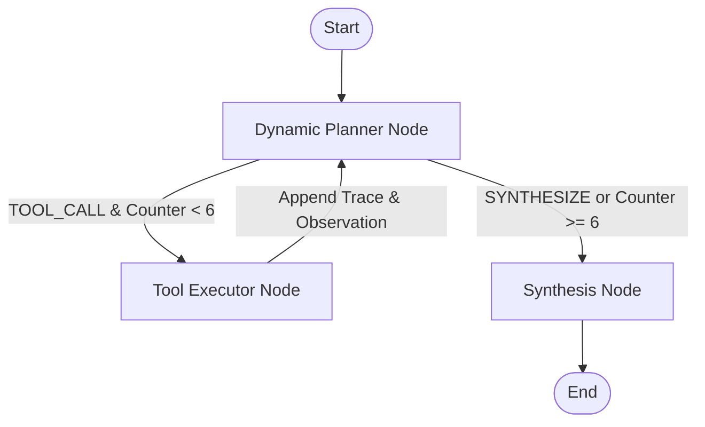

# Assignment 1: Tool-Using Research Agent

Autonomous LangGraph research agent evaluating in-memory caching systems for high-throughput, low-overhead production workloads.

## Target Research Question
> *"Compare Redis Cluster vs KeyDB for an in-memory caching layer handling 100k read req/sec, and recommend one for low-memory overhead deployments."*

---

## Architectural Overview

The agent is implemented as a cyclical state machine using LangGraph (`StateGraph`), orchestrating dynamic tool discovery, execution, error detection, and synthesis.



### State Schema (`AgentState`)
- `task` (`str`): Target research question.
- `messages` (`List[Any]`): Conversational message accumulator.
- `reasoning_trace` (`List[Dict[str, Any]]`): Itemized audit trail with `step`, `decision`, `rationale`, `action`, and `observation`.
- `tool_call_counter` (`int`): Hard safety monitor tracking total tool invocations.
- `mock_failure` (`bool`): Injected fault toggle for testing resilience.
- `final_synthesis` (`str`): Multi-section comparative engineering synthesis.
- `next_step` (`Optional[str]`): Dynamic routing signal (`TOOL_CALL` or `SYNTHESIZE`).
- `selected_tool` (`Optional[str]`): Discovered tool identifier.
- `selected_args` (`Optional[Dict[str, Any]]`): Extracted tool parameters.
- `current_rationale` (`Optional[str]`): Model-generated architectural justification.

---

## Tool Registry

| Tool | Signature | Purpose |
| :--- | :--- | :--- |
| `doc_lookup` | `(query: str) -> Dict[str, Any]` | Retrieves authoritative architecture specs, threading models, clustering topology, and baseline memory overheads. |
| `latency_math_engine` | `(throughput_rps: int, cores: int) -> Dict[str, Any]` | Computes per-core saturation factors, queue delay, and projected p99 tail latency curves. |
| `system_metrics_api` | `(engine: str, mock_failure: bool = False) -> Dict[str, Any]` | Queries live telemetry (QPS, CPU, RSS, per-key overhead). Returns HTTP 504 Gateway Timeout when `mock_failure=True`. |

---

## Failure Recovery & Safety Mechanisms

1. **Dynamic Decision Making**: Unlike hardcoded tool sequences, the agent evaluates accumulated findings at each turn using `gemini-3.1-flash-lite` structured output (`PlannerOutput`).
2. **Hard Safety Ceiling**: Enforces an invariant halt if `tool_call_counter >= 6`, preventing infinite loops or token budget blowups.
3. **Graceful Fault Pivoting**: When `system_metrics_api` returns an HTTP 504 error, the agent logs the outage into its reasoning rationale, adapts its strategy, pivots to `doc_lookup` and `latency_math_engine`, and successfully synthesizes the recommendation without runtime interruption.
4. **Rate-Limit Pacing**: Incorporates a 1.0-second delay between sequential turns to operate reliably within provider API rate limits.

---

## Reproduction Commands

### 1. Clean Execution Run
Executes the normal workflow with healthy telemetry:
```powershell
.\.venv\Scripts\python.exe assignment-1/agent.py --run-clean
```
- **Output Transcript**: `assignment-1/transcripts/transcript_1_clean.txt`

### 2. Failure Recovery Run
Simulates an upstream telemetry daemon failure (HTTP 504) and demonstrates runtime recovery:
```powershell
.\.venv\Scripts\python.exe assignment-1/agent.py --run-failure
```
- **Output Transcript**: `assignment-1/transcripts/transcript_2_failure_recovery.txt`
