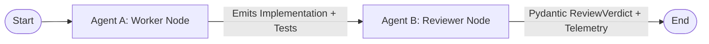

# Assignment 2: Multi-Agent Task with Review Gate

Autonomous multi-agent system pairing a software engineering worker agent (**Agent A**) with an auditing reviewer agent (**Agent B**) enforcing strict gatekeeping criteria before code acceptance.

## System Objective
> *"Design and review an asynchronous FastAPI Token-Bucket Rate Limiter middleware, enforcing concurrency safety, edge-case resilience, test coverage, and strict typing."*

---

## Architectural Workflow

The system is constructed with LangGraph as a sequential review pipeline with explicit data and telemetry flow:



### State Schema (`MultiAgentState`)
- `task` (`str`): Multi-agent objective description.
- `scenario` (`Literal["pass", "fail"]`): Execution mode driving Agent A's output quality.
- `worker_output` (`str`): Complete Python implementation and pytest suite generated by Agent A.
- `review_verdict` (`Optional[Dict[str, Any]]`): Structured Pydantic audit verdict from Agent B.
- `telemetry` (`Dict[str, int]`): Aggregated token and invocation metrics captured via LangChain callbacks.

---

## Explicit Grading Rubric (Review Criteria)

Agent B conducts an uncompromising audit against four mandatory criteria:

1. **Concurrency Safety**:
   - **Requirement**: Must implement atomic locks (`asyncio.Lock`) per bucket key to prevent race conditions during token replenishment and consumption across concurrent ASGI coroutines.
2. **Edge-Case Resilience**:
   - **Requirement**: Must explicitly handle zero or negative capacity, zero/negative refill rates, and utilize `time.monotonic()` instead of `time.time()` to prevent vulnerability to system clock drift and NTP adjustments.
3. **Test Completeness**:
   - **Requirement**: Must provide a minimum of two runnable, valid pytest test cases (e.g. using `starlette.testclient.TestClient` or `httpx.AsyncClient`) asserting both allowed requests (200 OK) and throttled requests (429 Too Many Requests).
4. **Type Annotations & Docstrings**:
   - **Requirement**: Must provide complete Python 3 standard type annotations across all function signatures and parameters, accompanied by concise docstrings.

### Structured Verdict Model (`ReviewVerdict`)
```python
class ReviewVerdict(BaseModel):
    verdict: Literal["APPROVED", "REJECTED"]
    criteria_scores: Dict[str, bool]
    rejection_reasons: List[str]
    review_notes: str
```

---

## Telemetry & Token Tracking

Telemetry tracking is integrated via `TelemetryCallbackHandler(BaseCallbackHandler)`. It captures:
- Total LLM invocations across all graph nodes
- Input / Prompt tokens
- Output / Completion tokens
- Aggregate total tokens consumed

### Observed Execution Metrics
| Scenario | LLM Invocations | Prompt Tokens | Completion Tokens | Total Tokens | Gate Verdict |
| :--- | :---: | :---: | :---: | :---: | :---: |
| **Pass Scenario** | 2 | ~1,503 | ~1,244 | ~2,747 | **APPROVED** |
| **Fail Scenario** | 2 | ~814 | ~759 | ~1,573 | **REJECTED** |

---

## Reproduction Commands

### 1. Approval Scenario (`pass`)
Executes Agent A in high-assurance mode, producing robust middleware with locks, monotonic clock, input validation, and pytest test suite. Agent B grants unanimous approval.
```powershell
.\.venv\Scripts\python.exe assignment-2/agent.py --scenario pass
```
- **Output Transcript**: `assignment-2/transcripts/transcript_1_approved.txt`

### 2. Rejection Scenario (`fail`)
Executes Agent A in draft mode without locks or unit tests. Agent B catches all violations, fails the scorecard, and itemizes rejection reasons.
```powershell
.\.venv\Scripts\python.exe assignment-2/agent.py --scenario fail
```
- **Output Transcript**: `assignment-2/transcripts/transcript_2_rejected.txt`
