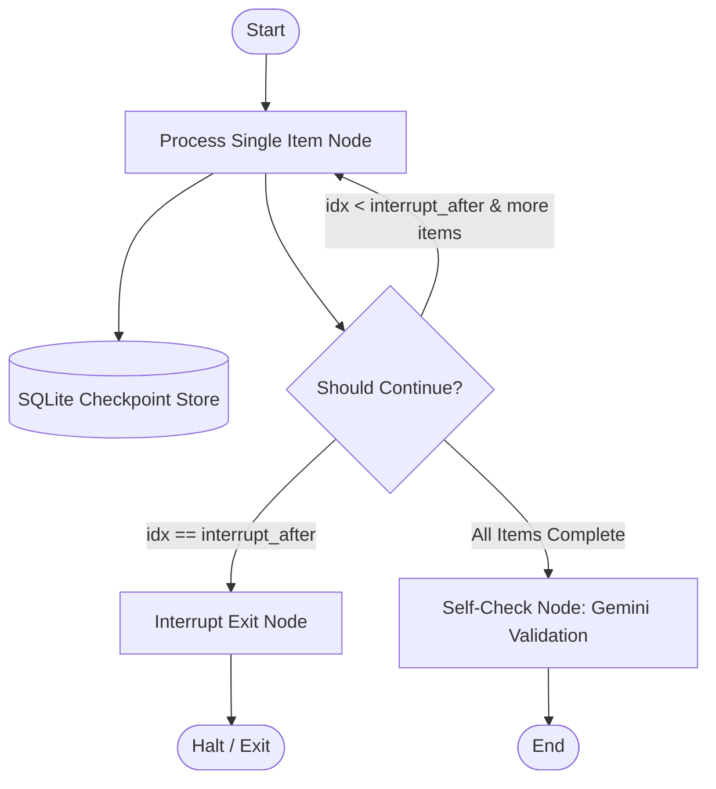

# Assignment 3: Resumable Agent with Checkpointing

Fault-tolerant sequential processing agent leveraging LangGraph native state checkpointing with SQLite (`SqliteSaver`) to guarantee zero-loss state recovery across hardware interrupts, process crashes, and pipeline pauses.

## Objective
> *"Sequentially process 4 microservice configurations (`auth_service.json`, `billing_service.json`, `gateway_service.json`, `event_stream.json`), extracting compliance flags, exposed ports, and rate limits. Support simulated mid-stream termination, state resumption with skipped items, and downstream schema validation."*

---

## Architectural Topology & State Recovery



### State Schema (`CheckpointState`)
```python
class CheckpointState(TypedDict):
    items_to_process: List[str]
    completed_items: Dict[str, Any]
    current_index: int
    validation_results: Dict[str, Any]
    total_llm_calls: int
    execution_log: List[str]
    interrupt_after: Optional[int]
    corrupt_item: Optional[int]
```

- **Persistence Layer**: `langgraph.checkpoint.sqlite.SqliteSaver` targeting `state_store/agent_state.db`.
- **Thread Isolation**: Graph operations are scoped to `thread_id="microservice_pipeline_thread"`.
- **Atomic Commits**: State transitions commit to SQLite after each item extraction node, ensuring zero lost progress if SIGINT or host termination occurs.

---

## Resume Semantics & Skip Logic

When executed with `--resume`:
1. The agent connects to `state_store/agent_state.db` and loads the latest snapshot for `microservice_pipeline_thread`.
2. Inspects `completed_items` to determine already verified artifacts.
3. Emits explicit audit logs:
   - `[RESUME SKIP]`: Logged for items completed prior to interruption (e.g. `auth_service.json`, `billing_service.json`).
   - `[RESUME PENDING]`: Logged for remaining items (e.g. `gateway_service.json`, `event_stream.json`).
4. Re-enters the state machine at `current_index = 2` without re-invoking the LLM for previously completed services.

---

## Validation & Self-Check Rules

The `self_check` node runs after all items are extracted. It invokes `gemini-3.1-flash-lite` with Pydantic structured output (`SelfCheckVerdict`) evaluating 4 invariants:
1. `service_name` must be a non-empty string.
2. `compliance_flags` must contain at least one recognized standard (e.g. SOC2, PCI-DSS, HIPAA, GDPR).
3. `exposed_ports` must contain at least one positive integer port.
4. `rate_limits` must contain valid algorithm and throughput parameters.

### Corruption Invariant Testing (`--corrupt-item 3`)
Injects an empty schema into item 3 (`gateway_service.json`). The Self-Check node catches all violations, sets `all_valid=False`, logs itemized errors, and records the defect trace.

---

## Reproduction Commands

### 1. Interrupted Run & Resumption
Step A: Process items 1 and 2, then simulate process termination:
```powershell
.\.venv\Scripts\python.exe assignment-3/agent.py --interrupt-after 2
```

Step B: Resume pipeline from checkpoint, skip items 1 & 2, finish items 3 & 4, and run self-check:
```powershell
.\.venv\Scripts\python.exe assignment-3/agent.py --resume
```
- **Output Transcript**: `assignment-3/transcripts/transcript_1_resumed.txt`

### 2. Validation Failure Detection Run
Execute pipeline with intentional schema corruption injected on item 3:
```powershell
.\.venv\Scripts\python.exe assignment-3/agent.py --corrupt-item 3
```
- **Output Transcript**: `assignment-3/transcripts/transcript_2_validation_failed.txt`
