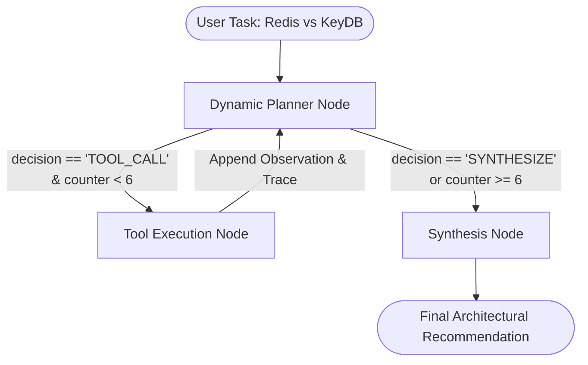
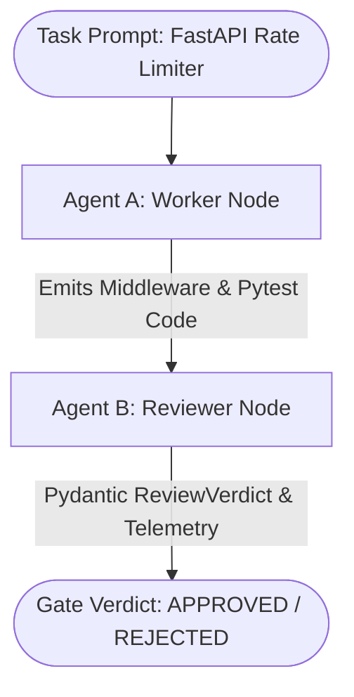
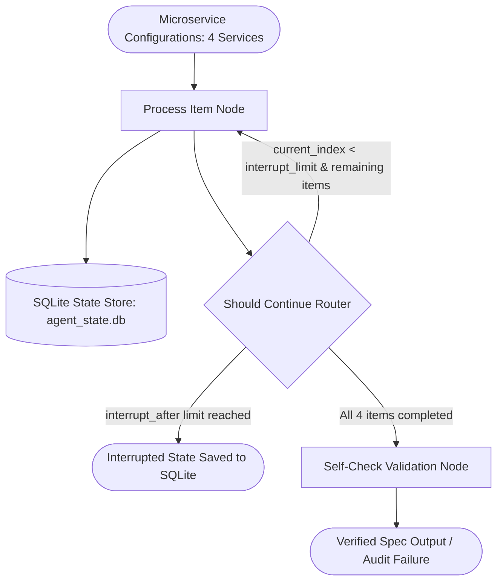
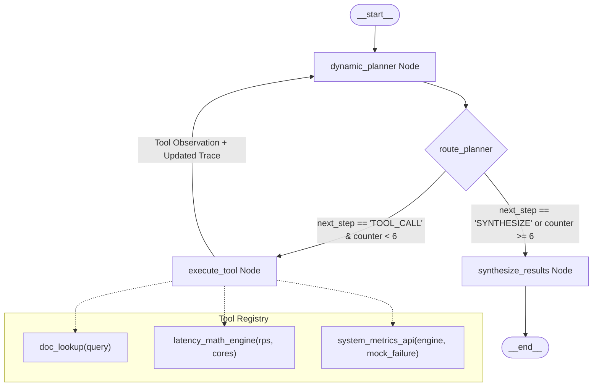
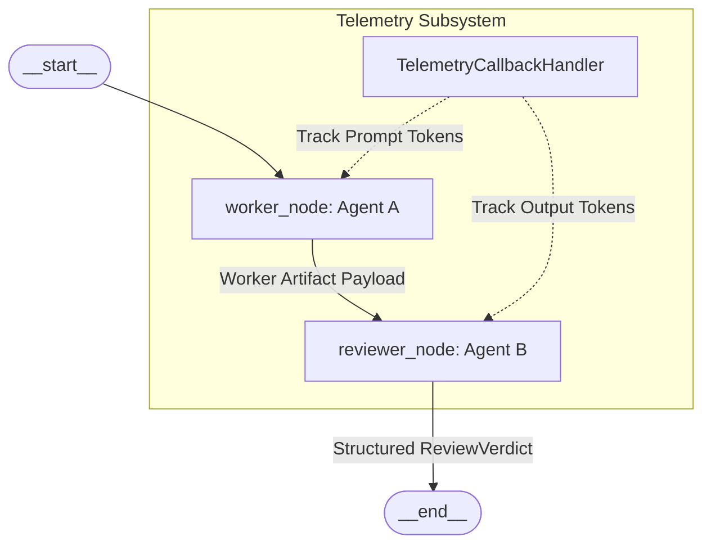
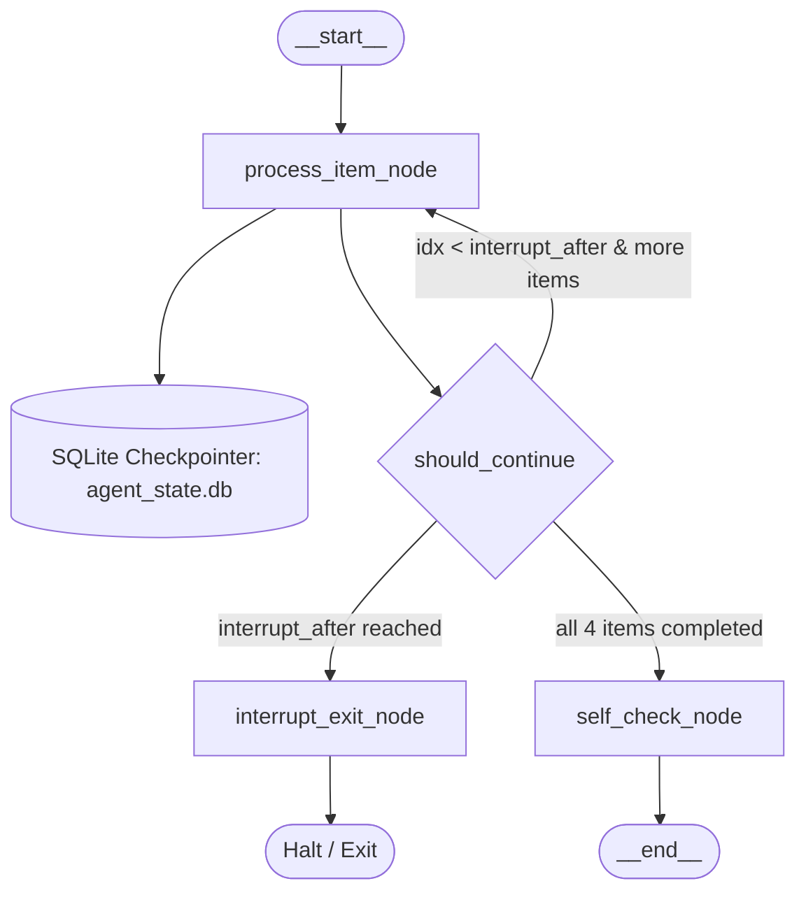

# Agentic Foundry Suite: Topological Architecture Specification

This document provides the definitive topological and architectural blueprint of the three agentic systems comprising the **Agentic Foundry Suite**. Each architecture leverages **LangGraph**, typed state channels, deterministic safety boundaries, and structured Gemini outputs.

---

## 1. Global Architectural Overview

### 1.1 Assignment 1: Tool-Using Research Agent (Cyclic Planning & Tool Execution)


### 1.2 Assignment 2: Multi-Agent Review Gate (Worker-Reviewer Pipeline)


### 1.3 Assignment 3: Resumable Checkpoint Pipeline (Stateful Transaction Logging)


---

## 2. Assignment 1: Tool-Using Research Agent Architecture

### 2.1 Topology & Graph Configuration
Assignment 1 implements a cyclical ReAct-style graph with dynamic decision planning, hard safety bounds, and failure recovery.



### 2.2 Node Responsibilities
- **`dynamic_planner`**:
  - Contextualizes accumulated reasoning steps (`reasoning_trace`), remaining tool budget (`tool_call_counter`), and prior tool observations.
  - Queries `ChatGoogleGenerativeAI(model="gemini-3.1-flash-lite")` with structured Pydantic schema `PlannerOutput`.
  - Determines whether to call another tool or synthesize the recommendation.
- **`execute_tool`**:
  - Resolves target tool identifier and unpacks typed arguments.
  - Executes tool with exception handling.
  - Captures structured observation, increments `tool_call_counter`, and appends an immutable step record to `reasoning_trace`.
- **`synthesize_results`**:
  - Consolidates complete reasoning trace and empirical metrics.
  - Produces multi-section architectural comparison (Executive Summary, Threading Model, 100k RPS Latency, Memory Overhead, Fault Audit, Deployment Blueprint).

### 2.3 Hard Ceiling & Failure Recovery Invariants
- **Hard Safety Ceiling**: If `tool_call_counter >= 6`, the planner forces `next_step = "SYNTHESIZE"`, bypassing tool execution and halting token drain.
- **Fault Recovery Pivot**: When `system_metrics_api` encounters an injected 504 Gateway Timeout, the planner catches the failure, logs the outage rationale, and dynamically pivots to `doc_lookup` and `latency_math_engine`.

---

## 3. Assignment 2: Multi-Agent Review Gate Architecture

### 3.1 Topology & Pipeline Configuration
Assignment 2 establishes a unidirectional producer-consumer audit pipeline with independent persona boundaries and strict evaluation gates.



### 3.2 Node Responsibilities
- **`worker_node` (Agent A)**:
  - Acts as Senior Distributed Systems Engineer (in `pass` scenario) or Junior Developer Draft Mode (in `fail` scenario).
  - Emits full Python middleware codebase, concurrency control mechanisms, and pytest test suite.
- **`reviewer_node` (Agent B)**:
  - Implements zero-trust code audit using Pydantic structured output (`ReviewVerdict`).
  - Evaluates code against 4 strict criteria:
    1. `concurrency_safety` (atomic locks / thread safety)
    2. `edge_case_resilience` (zero/negative capacity, non-positive refill, monotonic clock drift defense)
    3. `test_completeness` (minimum 2 valid pytest test cases)
    4. `type_annotations_and_docstrings` (full Python 3 typing and clear docstrings)
  - Emits itemized failure descriptions if any criterion fails.

---

## 4. Assignment 3: Resumable Checkpoint Pipeline Architecture

### 4.1 Topology & Persistence Configuration
Assignment 3 combines sequential loop execution with transactional state checkpointing on SQLite.



### 4.2 State Channel Invariants & Persistence
- **Channel Schema**:

```python
class CheckpointState(TypedDict):
    items_to_process: List[str]
    completed_items: Dict[str, Any]
    current_index: int
    validation_results: Dict[str, Any]
    total_llm_calls: int
    execution_log: List[str]
    interrupt_after: Optional[int]
    corrupt_item: Optional[int]
```

- **Checkpoint Engine**: `SqliteSaver` creates and manages table `checkpoints` and `checkpoint_blobs` inside `state_store/agent_state.db`.
- **Resumption Semantics**:
  - `graph.get_state(config)` inspects completed microservice keys.
  - Emits `[RESUME SKIP]` for previously committed items, completely eliminating redundant LLM calls.
  - Emits `[RESUME PENDING]` and resumes execution strictly on remaining items.
- **Downstream Self-Check**:
  - Audits all completed extractions against 4 schema invariants (non-empty service name, valid compliance standards, exposed ports, valid rate limits).
  - Flags corrupted items with itemized failure descriptions.
