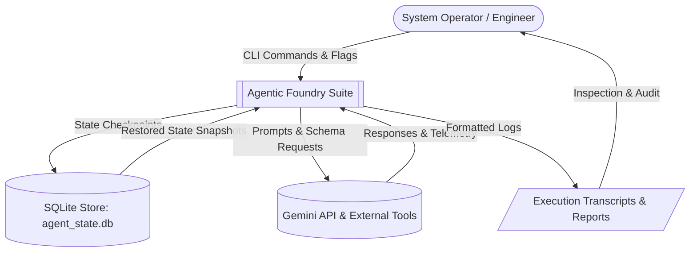
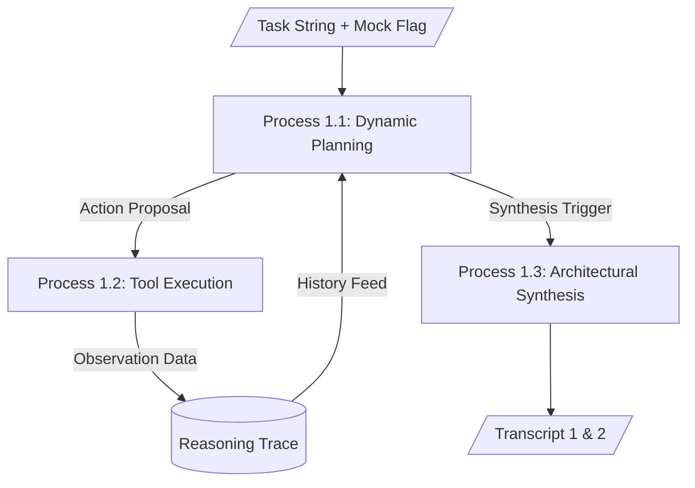
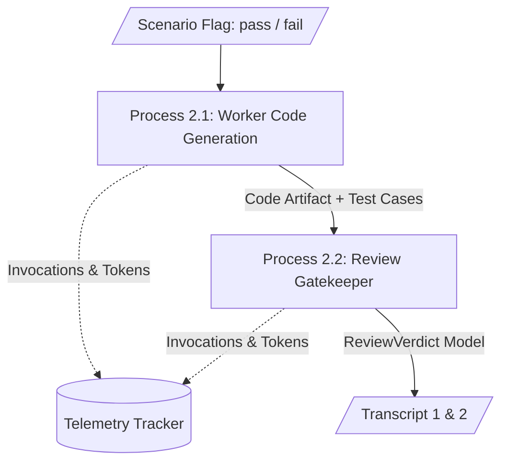
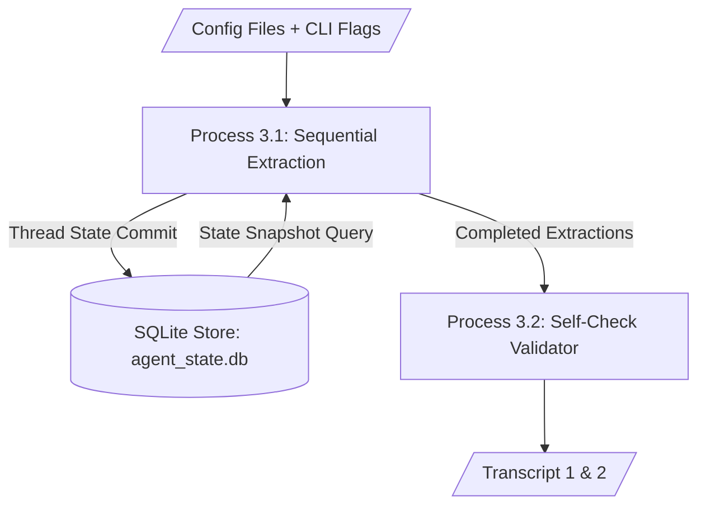
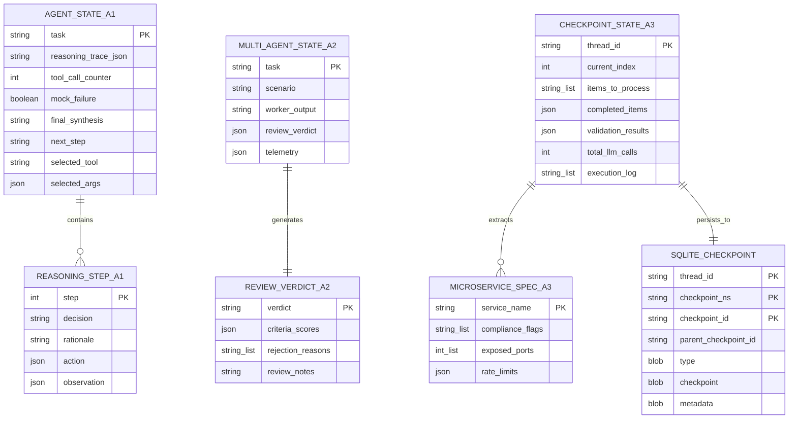

# Agentic Foundry Suite: Data Flow Diagrams & Entity Relationships

This document presents the **Data Flow Diagrams (DFD Level 0 and Level 1)** and the **Entity Relationship (ER) schemas** for the state models and SQLite persistence tables across the suite.

---

## 1. Data Flow Diagrams (DFD)

### 1.1 DFD Level 0: Context Level



---

### 1.2 DFD Level 1: Subsystem Level

### 1.2.1 Subsystem 1: Assignment 1 (Research Agent)


### 1.2.2 Subsystem 2: Assignment 2 (Review Gate)


### 1.2.3 Subsystem 3: Assignment 3 (Resumable Checkpointer)


---

<div style="page-break-before: always;"></div>

## 2. Entity Relationship (ER) Schemas

### 2.1 Agent State Entity Relationship Diagram



---

## 3. Database Schema: SQLite State Store (`agent_state.db`)

When using `langgraph.checkpoint.sqlite.SqliteSaver`, the backing SQLite database contains the following formal schema:

### 3.1 Table: `checkpoints`
Stores sequential graph execution snapshots keyed by thread and checkpoint version:
```sql
CREATE TABLE IF NOT EXISTS checkpoints (
    thread_id TEXT NOT NULL,
    checkpoint_ns TEXT NOT NULL DEFAULT '',
    checkpoint_id TEXT NOT NULL,
    parent_checkpoint_id TEXT,
    type TEXT,
    checkpoint BLOB,
    metadata BLOB,
    PRIMARY KEY (thread_id, checkpoint_ns, checkpoint_id)
);
```

### 3.2 Table: `checkpoint_blobs`
Stores binary serialized state payloads using orjson/msgpack serialization:
```sql
CREATE TABLE IF NOT EXISTS checkpoint_blobs (
    thread_id TEXT NOT NULL,
    checkpoint_ns TEXT NOT NULL DEFAULT '',
    channel TEXT NOT NULL,
    version TEXT NOT NULL,
    type TEXT,
    blob BLOB,
    PRIMARY KEY (thread_id, checkpoint_ns, channel, version)
);
```

### 3.3 Table: `checkpoint_writes`
Captures pending intermediate channel writes between execution steps:
```sql
CREATE TABLE IF NOT EXISTS checkpoint_writes (
    thread_id TEXT NOT NULL,
    checkpoint_ns TEXT NOT NULL DEFAULT '',
    checkpoint_id TEXT NOT NULL,
    task_id TEXT NOT NULL,
    idx INTEGER NOT NULL,
    channel TEXT NOT NULL,
    type TEXT,
    blob BLOB,
    PRIMARY KEY (thread_id, checkpoint_ns, checkpoint_id, task_id, idx)
);
```
