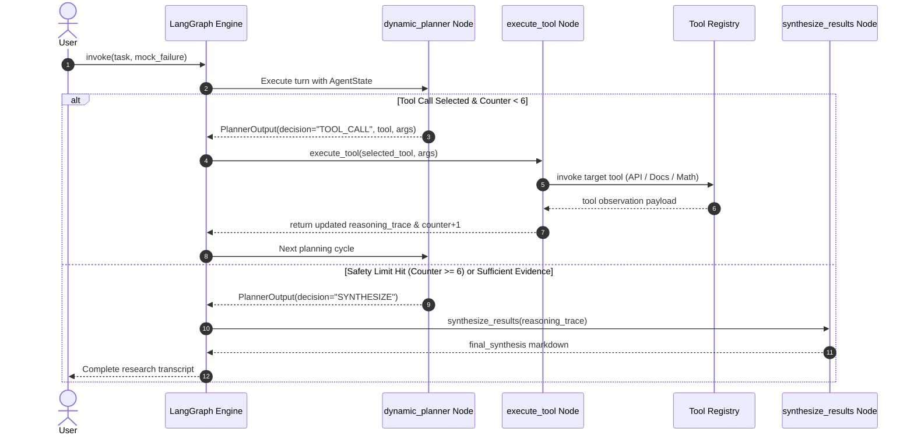
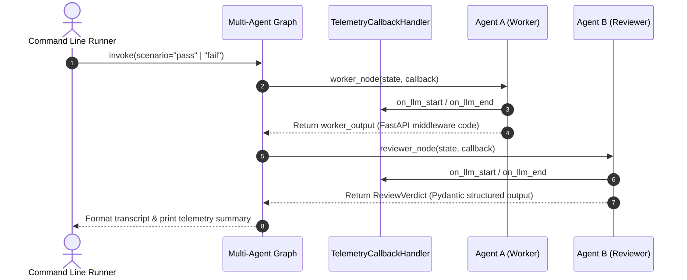
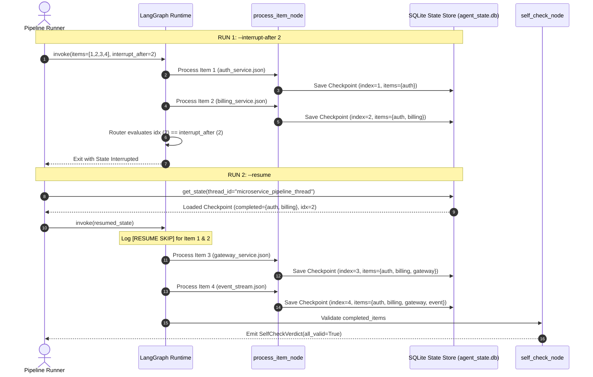

# Agentic Foundry Suite: Execution Workflows & State Lifecycles

This document details the lifecycle workflows, step-by-step state transitions, loop control mechanics, and checkpointer recovery pathways across all three assignments.

---

## 1. Assignment 1 Workflow: Dynamic Tool-Using Research Agent

### 1.1 State Transition Lifecycle



### 1.2 Failure Recovery Decision Path
1. **Initial Action**: The agent chooses `system_metrics_api(engine="redis")` to query live telemetry.
2. **Error Injection**: When `mock_failure=True`, the tool returns:
   ```json
   {"status": 504, "error": "Gateway Timeout: Telemetry daemon unreachable after 5000ms"}
   ```
3. **Detection & Pivot**: In the next turn, `dynamic_planner` inspects the trace, detects the 504 error, and logs:
   > *"The system_metrics_api returned a 504 Gateway Timeout for the Redis telemetry query. Given the failure to retrieve live metrics, I must pivot to theoretical analysis. I will use doc_lookup to retrieve the architectural specifications..."*
4. **Resilient Continuation**: Executes `doc_lookup` and `latency_math_engine`, successfully obtaining the metrics needed to complete the recommendation without crashing.

---

## 2. Assignment 2 Workflow: Multi-Agent Review Gate

### 2.1 Workflow Pipeline



### 2.2 Branching Scenarios & Verdict State Matrix

| Step / Property | Pass Scenario (`--scenario pass`) | Fail Scenario (`--scenario fail`) |
| :--- | :--- | :--- |
| **Worker Directive** | High-assurance production implementation | Draft mode with intentional defects |
| **Locks Present** | `asyncio.Lock()` per key | None (naked shared dictionary) |
| **Clock Source** | `time.monotonic()` (clock-drift immune) | `time.time()` (vulnerable to NTP jumps) |
| **Input Validation** | Rejects `capacity <= 0` or `refill <= 0` | Missing |
| **Pytest Cases** | 2 valid async/sync test cases | 0 test cases |
| **Reviewer Verdict**| **APPROVED** | **REJECTED** |
| **Criteria Scores** | 4/4 True | 0/4 True |
| **Rejection Reasons**| None (empty list) | 5 itemized failure reasons |

---

## 3. Assignment 3 Workflow: Resumable Checkpoint Pipeline

### 3.1 Interruption & Resumption Lifecycle



### 3.2 Corrupted Item Self-Check Decision Path (`--corrupt-item 3`)
1. **Pipeline Execution**: Items 1, 2, 3, and 4 are processed sequentially.
2. **Fault Injection**: At index 3 (`gateway_service.json`), the pipeline injects an empty payload:
   ```json
   {
     "service_name": "",
     "compliance_flags": [],
     "exposed_ports": [],
     "rate_limits": {}
   }
   ```
3. **Self-Check Audit**: The `self_check` node runs Gemini against all 4 records.
4. **Violation Catch**:
   - `all_valid`: `false`
   - `flagged_errors`:
     - `gateway_service.json: service_name is empty`
     - `gateway_service.json: compliance_flags is empty`
     - `gateway_service.json: exposed_ports is empty`
     - `gateway_service.json: rate_limits is empty`
5. **Report Generation**: State is committed and recorded in `transcript_2_validation_failed.txt`.
