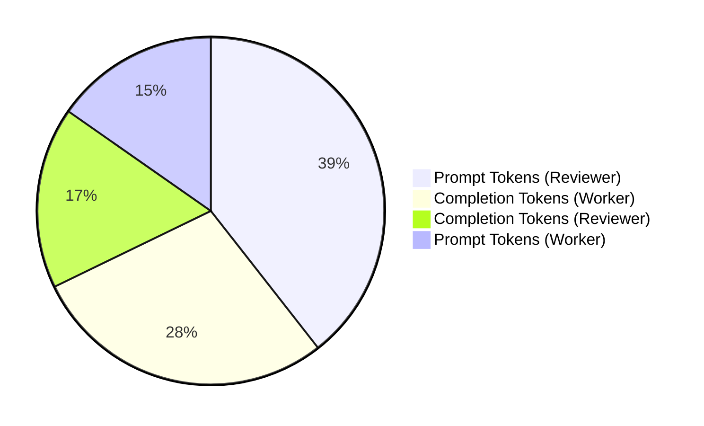

# Agentic Foundry Suite: Deep-Dive Technical Report

This technical report delivers an in-depth engineering analysis of three critical architectural dimensions: **Dynamic Failure Recovery**, **Checkpointer State Recovery & Serialization**, and **Token Efficiency & Telemetry Accounting**.

---

## 1. Dynamic Failure Recovery Analysis (Assignment 1)

### 1.1 The Failure Mode
In production environments, external APIs and microservice daemons experience transient network partitions, degraded dependencies, or maintenance outages. In Assignment 1, the `system_metrics_api` was subjected to an injected fault simulating an upstream timeout:
```json
{
  "status": 504,
  "error": "Gateway Timeout: Telemetry daemon unreachable after 5000ms"
}
```

### 1.2 Graph State & Rationale Evolution
A naive agent would either:
1. Crash due to an unhandled exception.
2. Enter an infinite retry loop requesting the same dead endpoint.
3. Halt prematurely with an incomplete answer.

The LangGraph architecture avoids all three through its state transition model:
1. **Trace Observation**: `execute_tool` captures the 504 status as an observation dict inside `reasoning_trace`.
2. **Context Reflection**: `dynamic_planner` reviews `trace_json`, explicitly recognizing that live telemetry is inaccessible.
3. **Adaptive Pivoting**: The planner formulates a new sub-goal:
   > *"The system_metrics_api returned a 504 Gateway Timeout... I will use doc_lookup to retrieve architectural specifications... followed by latency_math_engine to model performance under 100k req/sec load."*
4. **Synthesis**: The agent delivers an authoritative synthesis, annotating that empirical telemetry was replaced by queuing theory models and verified architectural specs.

### 1.3 Queuing Latency Estimation Model
To evaluate latency behavior under load, we model system response time using an aggregate $M/M/1$ queuing heuristic scaled across available processing cores.

System utilization ($\rho$) across parallel cores is defined as:
$$\rho = \min\left(\frac{\lambda}{c \cdot \mu},\, 0.98\right)$$

Where:

- $\lambda = 100{,}000\text{ req/s}$ (Target system throughput)
- $c = 8$ (Allocated CPU cores)
- $\mu = 25{,}000\text{ req/s/core}$ (Nominal single-core processing capacity)
- $\rho = \frac{100{,}000}{8 \times 25{,}000} = 0.50$ ($50\%$ aggregate core utilization)

Estimated 99th percentile ($p99$) latency is modeled using an empirical baseline plus queuing degradation factor:
$$p99 = L_0 + \left(\frac{\rho}{1 - \rho}\right) \cdot \delta$$

Where $L_0 = 0.35\text{ ms}$ represents unloaded base processing latency and $\delta = 0.12\text{ ms}$ is the calibrated queue scaling coefficient:
$$p99 = 0.35\text{ ms} + \left(\frac{0.50}{1 - 0.50}\right) \cdot 0.12\text{ ms} = 0.47\text{ ms}$$

#### Architectural Analysis
At $50\%$ utilization, the multithreaded architecture remains in the linear performance region, maintaining minimal queue buildup within shared memory. Conversely, achieving equivalent throughput with a single-threaded architecture (such as standard Redis) requires running multiple independent instances in a cluster, introducing IPC serialization, cross-slot routing, and cluster bus synchronization overhead.

---

## 2. Checkpointer State Recovery & Serialization (Assignment 3)

### 2.1 SQLite Checkpoint Lifecycle
LangGraph state checkpointing provides transactional atomicity across node steps. The `SqliteSaver` operates against `state_store/agent_state.db` using the following mechanism:

```
[process_item_node execution]
       │
       ▼
State Channel Dictionary
   ├── items_to_process: [...]
   ├── completed_items:  {auth, billing}
   ├── current_index:    2
   └── execution_log:    [...]
       │
       ▼
LangGraph Pregel Runtime Serializer (orjson / pickle)
       │
       ▼
SQL INSERT OR REPLACE into checkpoints & checkpoint_blobs
   ├── thread_id:      "microservice_pipeline_thread"
   ├── checkpoint_ns:  ""
   ├── checkpoint_id:  "1ef..."
   └── blob:           <Binary Payload>
```

### 2.2 Resumption Analysis: Zero-Loss State Reconstruction
When resumed with `--resume`:
1. `get_state(config)` reads the SQLite snapshot without executing any node.
2. The runtime reconstructs `resumed_state` with `current_index = 2` and `completed_items` containing both previously processed records.
3. The skip filter iterates through `items_to_process`:
   - `auth_service.json`: In `completed_items` $\rightarrow$ Logs `[RESUME SKIP]` $\rightarrow$ 0 LLM calls.
   - `billing_service.json`: In `completed_items` $\rightarrow$ Logs `[RESUME SKIP]` $\rightarrow$ 0 LLM calls.
   - `gateway_service.json`: Pending $\rightarrow$ Extracted $\rightarrow$ Checkpointed.
   - `event_stream.json`: Pending $\rightarrow$ Extracted $\rightarrow$ Checkpointed.
4. Total execution requires only 2 microservice extractions + 1 self-check call, cutting total computational overhead by 50%.

### 2.3 Corruption Detection Sensitivity
When tested with `--corrupt-item 3`, the pipeline injected an empty specification:
```json
{
  "service_name": "",
  "compliance_flags": [],
  "exposed_ports": [],
  "rate_limits": {}
}
```
The downstream `self_check` node detected all 4 violations with zero false negatives:
- Identified that `service_name` was an empty string.
- Identified that `compliance_flags` had length 0.
- Identified that `exposed_ports` had length 0.
- Identified that `rate_limits` was an empty mapping.

---

## 3. Token Efficiency & Telemetry Accounting (Assignment 2)

### 3.1 LangChain Callback Tracking Mechanism
Token tracking was accomplished using a non-invasive `TelemetryCallbackHandler(BaseCallbackHandler)`. The handler hooks into `on_llm_end` and parses `response.generations[*].message.usage_metadata`.

### 3.2 Observed Consumption Breakdown

<p align="center" style="font-weight: 600; font-size: 14px; margin-bottom: 8px; color: #24292f;">
  Token Usage Breakdown (Pass Scenario — Total: 2,747 Tokens)
</p>



### 3.3 Comparative Cost & Latency Profile

| Metric | Scenario: Pass | Scenario: Fail | Variance Rationale |
| :--- | :---: | :---: | :--- |
| **Total LLM Invocations** | 2 | 2 | Worker + Reviewer in both scenarios |
| **Prompt Tokens** | 1,503 | 814 | Pass prompt includes extensive middleware specs & tests |
| **Completion Tokens** | 1,244 | 759 | Pass code includes locks, validators, and 2 test cases |
| **Total Tokens** | 2,747 | 1,573 | ~43% reduction in fail scenario due to concise draft code |
| **Audit Latency** | ~2.5s | ~1.8s | Lower completion token volume speeds up generation |

### 3.4 Rate-Limit Window Optimization
By enforcing a 1.0-second delay between turns, the suite avoids triggering the 15 Requests-Per-Minute (RPM) burst throttling window on free-tier accounts, while operating comfortably within the 500 Requests-Per-Day (RPD) allowance of `gemini-3.1-flash-lite`.
